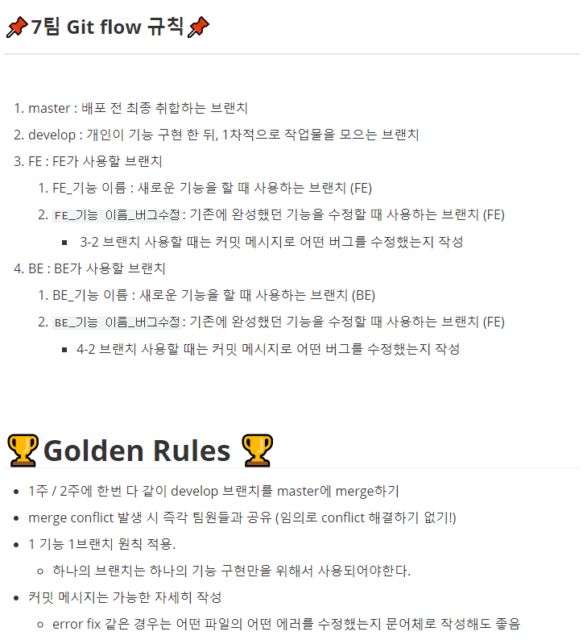
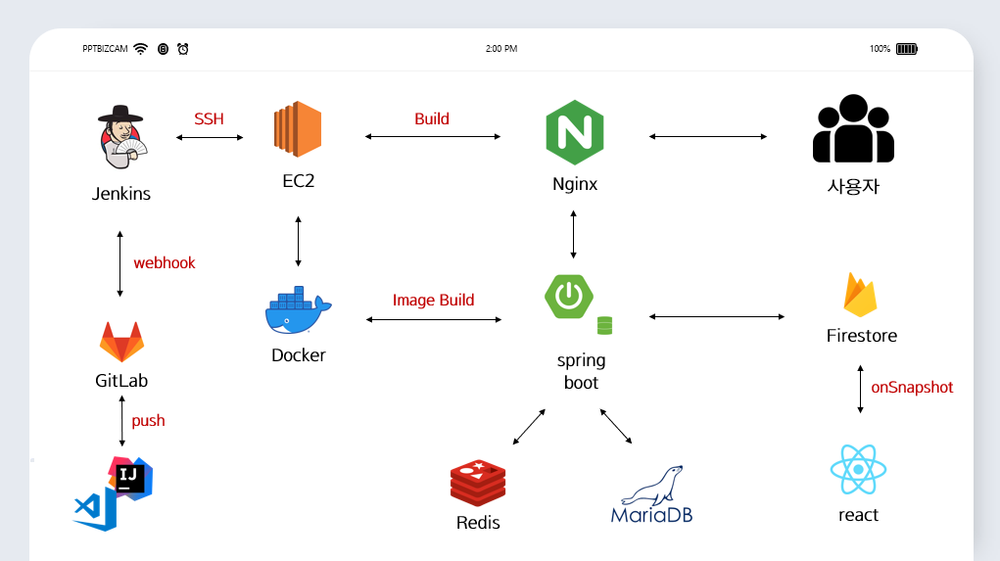
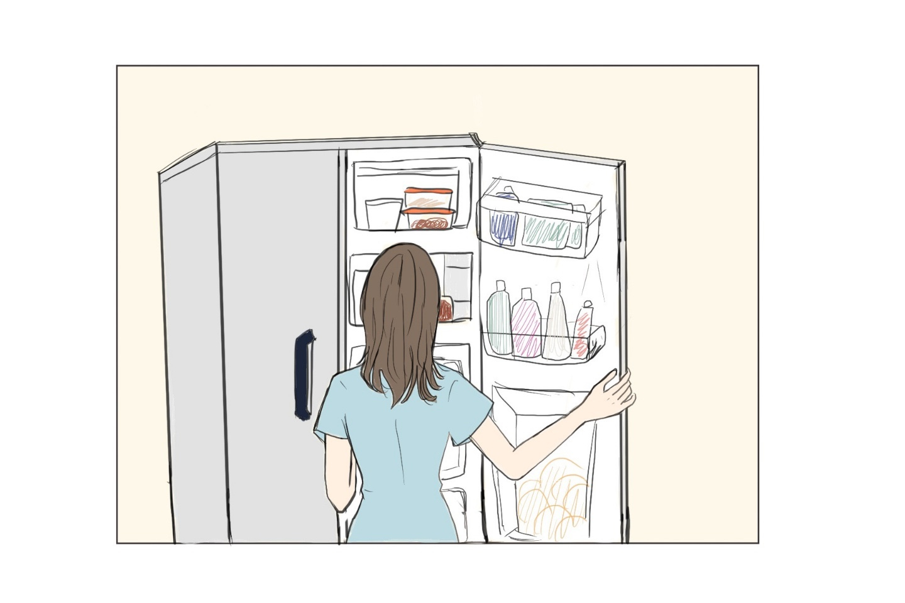

>README에 추가하거나, 수정하고 싶은 부분 있으면 자유롭게 수정해주세요!😁😁😁

# 🥇오늘 저녁은 미정🥇

** 이 위치에 움짤이 들어갈 예정입니다 **

## 목차

- [프로젝트 소개](#프로젝트-소개)   
  - [Key Feature](Key Feature)
- [Gitflow 규칙](#Gitflow 규칙)
- [프로젝트 명세](#프로젝트-명세)
  - [배포 환경](#배포-환경)
  - [개발 환경](#개발-환경)
  - [Design Resources](#design-resources)
  - [핵심 라이브러리](#핵심-라이브러리)
     

## 프로젝트 소개

> 집에 있는 재료들로 만드는 "진짜" 집밥 레시피 솔루션을 제공하고, 이웃들과 요리의 즐거움을 나눌 수 있는 커뮤니티 애플리케이션 입니다.

#### 🎉Key Feature🎉

1. 번거로운 준비 No! 지금 당장 해먹을 수 있는 요리만 추천해주는 맞춤형 요리 추천 시스템
2. 오늘의 인기 메뉴는?? 사용자들이 직접 뽑은 데일리 레시피 랭킹으로 날마다 새로운 식사를 할 수 있다.

## Gitflow 규칙

> 규칙 관련한 이슈는 **[여기](./회의록/gitflow.md)**로 이동하셔서 제안주시길 바랍니다.
>
> (마지막 업데이트 : 21/07/21)

## 프로젝트 명세

### 배포 환경

- __URL__ : http://i5c207.p.ssafy.io/
- __배포 여부__ : O 
- __접속 가능__ : 접속 가능 
- __HTTPS 적용__ : X
- __PORT__ : // 3rd Party에서 사용하는 포트가 있다면 기입해주세요. <- 기입 후 해당 주석 삭제
   

### 개발 환경

---

### Overall

#### Front-end 

- __Framework__ : React 
- __지원 환경__ : Web 
- __담당자__ : 이동윤, 이원종
   

#### Back-end

- __Framework__ : Spring boot 
- __Database__ : MySQL / MariaDB
- __담당자__ : 김수혁 / 류지우 / 오미정
   

#### Design

- __Framework 사용__ : O
  - [Material-ui](https://material-ui.com/)
- __Design Tool 사용__ :  Figma
- __담당자__ : 이동윤, 이원종
   

### Design Resources

---

__자체 제작 산출물__ (필요시 이미지 또는 설명 첨부)

* 프로젝트 소개 UCC

| 스토리보드                   | 웹툰                                                         | UCC  |
| ---------------------------- | ------------------------------------------------------------ | ---- |
|  |  |      |

* 담당자 : 이동윤/ 이원종 / 오미정

### 핵심 라이브러리

기본 제공하는 라이브러리 외 핵심 기능 구현에 사용한 라이브러리가 있다면 작성해주세요.   
예시 ) VR/AR 라이브러리, 애니메이션 라이브러리, 텍스트/사진/동영상 지원, 편집 라이브러리 등

- __sweetalert2__

  - __링크__ : https://sweetalert2.github.io/
  - __소개__ : 반응형 팝업 박스를 제공하는 라이브러리
  - __사용 기능__ : 사용자에게 각종 알람 제공
  - __담당자__ : 이동윤

  

- __TweenMax__

  - __링크__ : https://greensock.com/tweenmax/
  - __소개__ : JS 애니메이션 라이브러리
  - __사용 기능__ : 인터렉티브 애니메이션 표현
  - __담당자__ : 이동윤
  
  

* __Redux__ // __Redux-persist__

  * __링크__ : https://redux.js.org/
  * __소개__ : JS 중앙 상태관리 라이브러리 /  redux 상태를 로컬에서 관리하기 위한 라이브러리
  * __사용 기능__ : 회원정보 저장 및 옵션 상태 관리
  * __담당자__ : 이동윤 / 이원종

  

* __craco__
  * __링크__ : https://www.npmjs.com/package/@craco/craco
  * __소개__ : cra 환경을 유지하며, webpack 옵션을 조정할 수 있는 라이브러리
  * __사용 기능__ : 프로젝트 초기환경 구축
  * __담당자__ : 이동윤
