## 시연 시나리오

배포 주소 : http://i5c207.p.ssafy.io/

#### 1. 홈 화면 

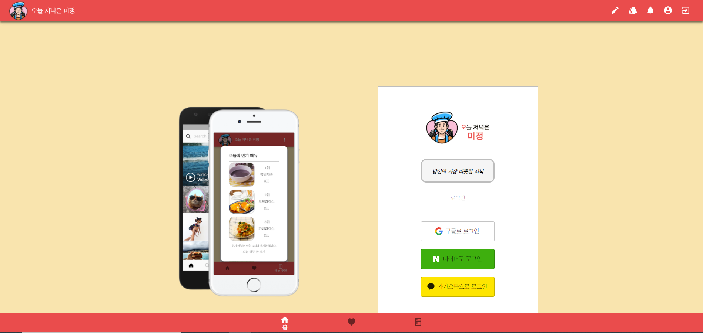

- 회원가입 - 소셜 로그인

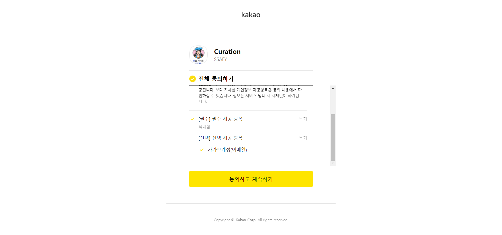

- 소셜 로그인 완료 후 닉네임 설정 페이지 

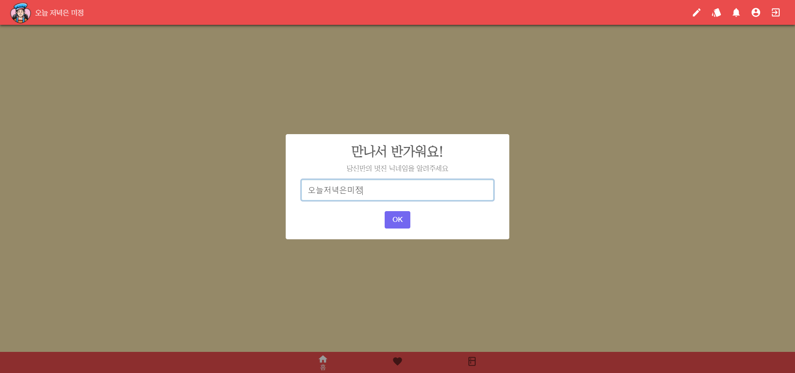

#### 2. 유저 페이지 

- 프로필 수정 기능 

  

  - 프로필 사진, 백그라운드 이미지, 닉네임, 자기소개 변경 가능

  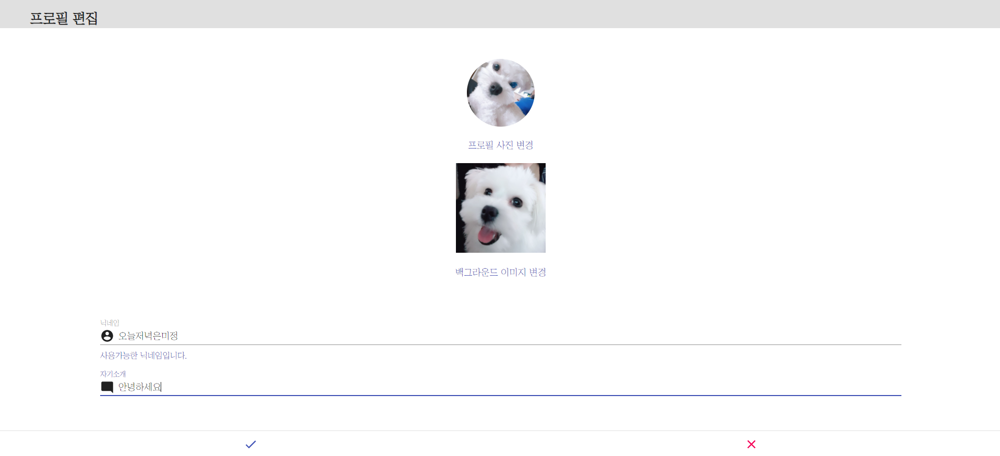

- 팔로우 기능 
  
  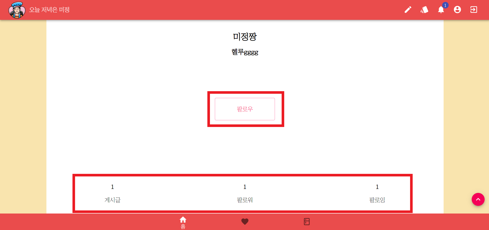
  
  - 팔로우 / 언팔로우 버튼
  - 팔로우 / 팔로워 수
  
- 작성한 게시글 목록(클릭 시 게시글 상세페이지) 

  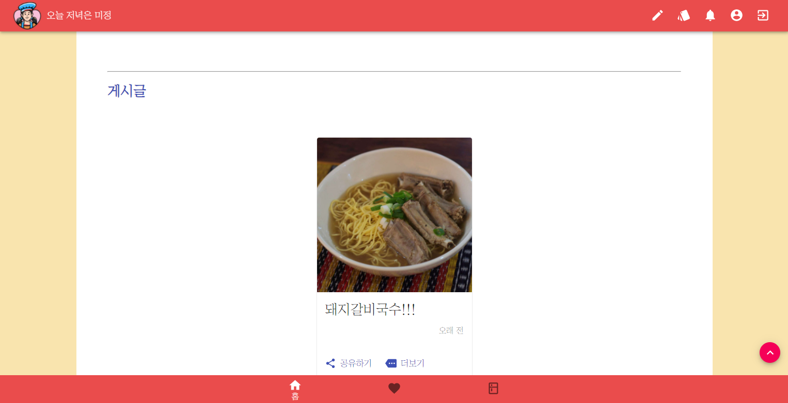

#### 3. 추천 

- 메인 재료, 서브 재료 선택 후 메뉴 추천 받기 클릭

  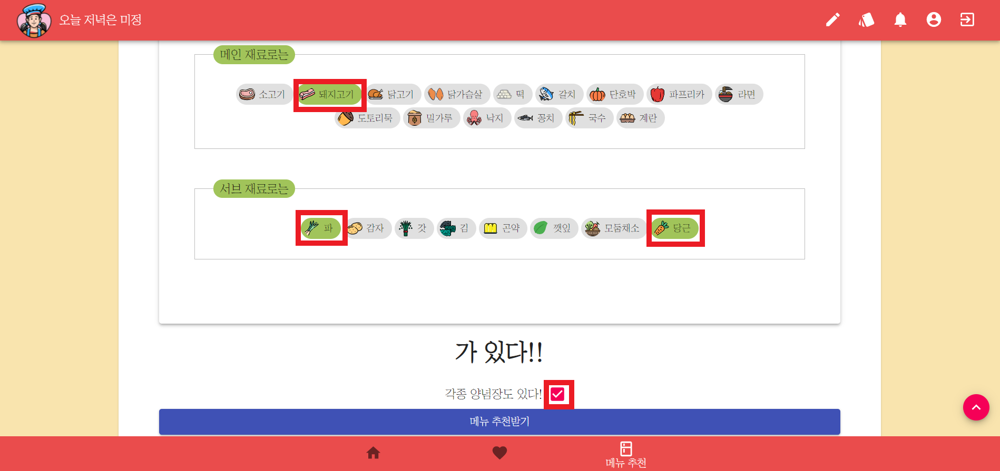

- `네 좋아요` 버튼 클릭 시 메뉴 한가지 추천 화면
  
  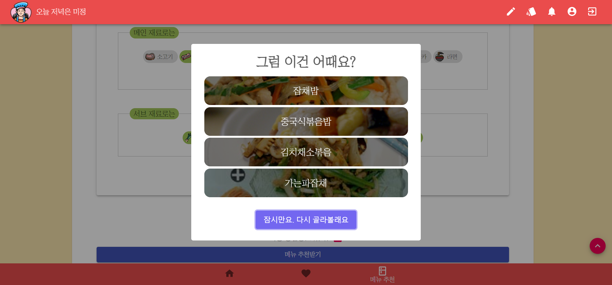
  
  - `좋아요` 버튼 클릭 시 레시피 상세 페이지
  
  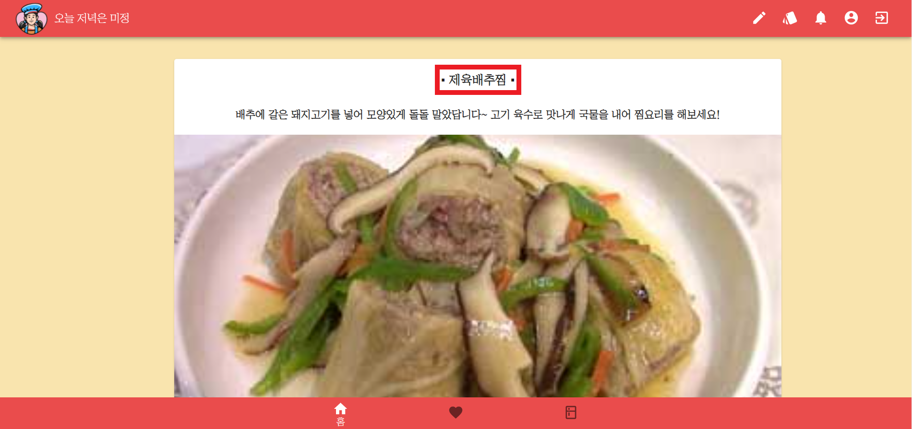
  
  - `음...별로예요'` 버튼 클릭 시 네 가지 추천 메뉴 리스트
  
  

#### 4. 레시피 목록 

- 스크랩 순으로 정렬

  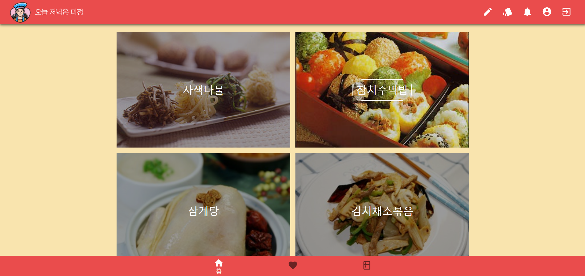

- 레시피 상세페이지 모달로 확인 가능

  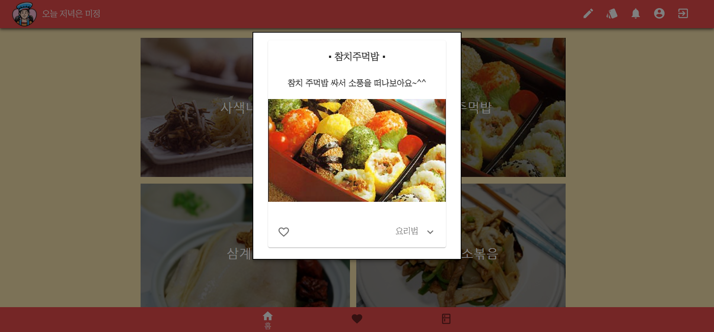

- 스크랩 기능 / 요리법 : 버튼 클릭 시 오픈

  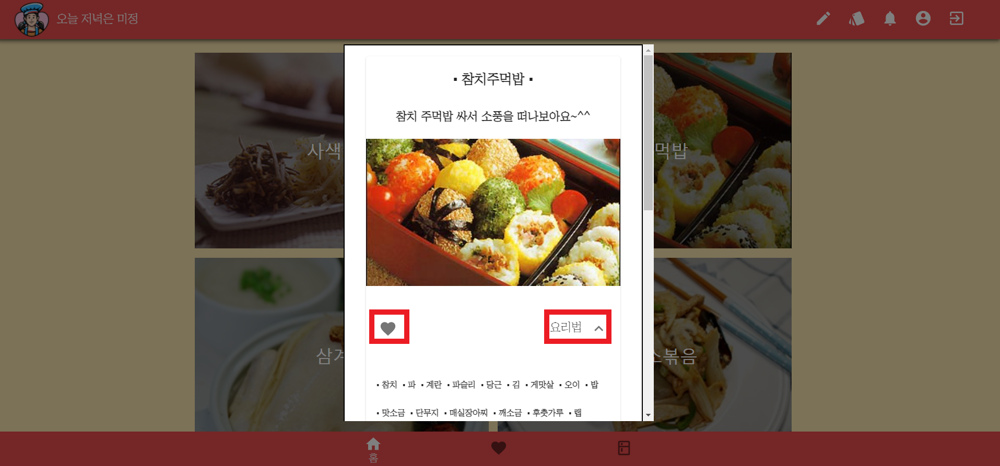

#### 5. 게시물 

- 게시물 작성

  - 제목, 레시피, 재료, 파일 선택 빠짐 없이 입력 후 등록 (누락 시 알림)

    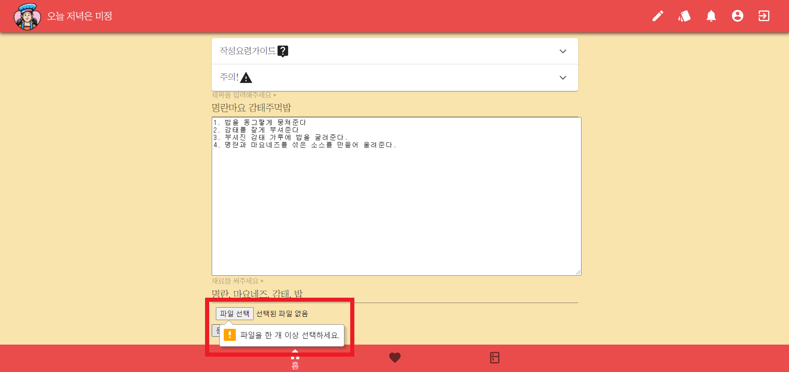

  -  게시물 상세 페이지

    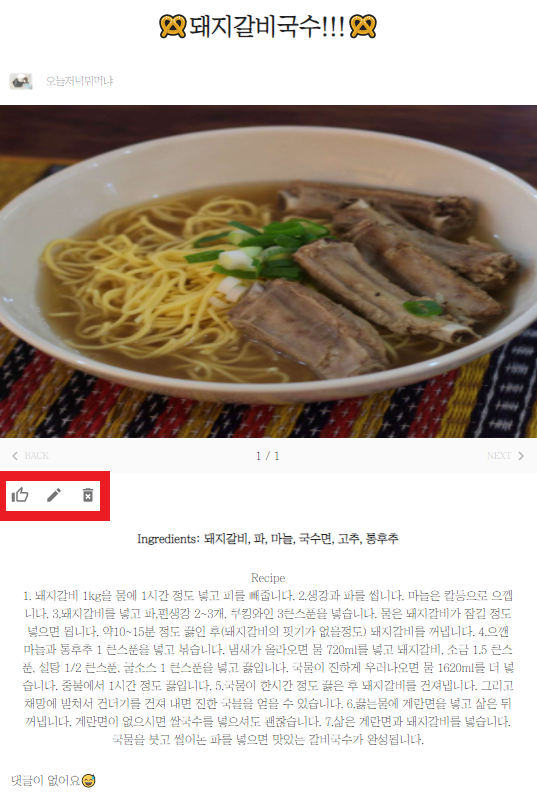

    1) 좋아요 기능 

    2) 게시물 수정 기능(작성자 본인만 가능) 

    3) 게시물 삭제 기능(작성자 본인만 가능) 
    
    4) 댓글 기능 - 댓글 작성, 댓글 삭제 기능 (실시간 반영)
    
    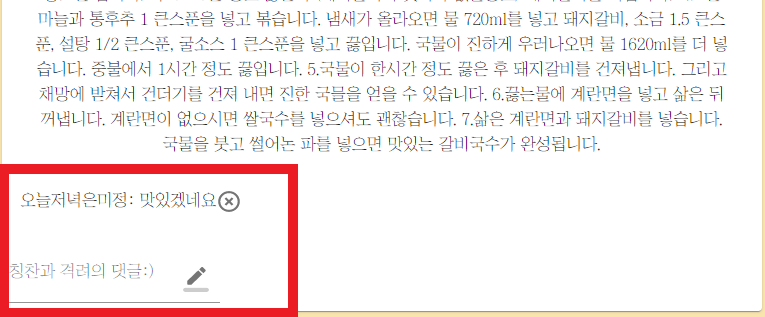

  

  

  

#### 6. 랭킹 

- 레시피 추천 기능 사용 후 `네 좋아요` 버튼 클릭된 횟수 바탕으로 1,2,3위 메뉴 추천

  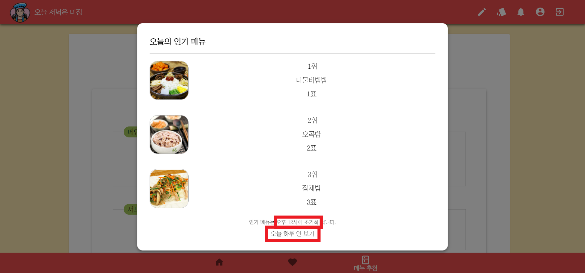

  - 12시 초기화 기능
  - 오늘 하루 안보기 기능

#### 7. 알림 

- 팔로우 요청시 실시간 알림

  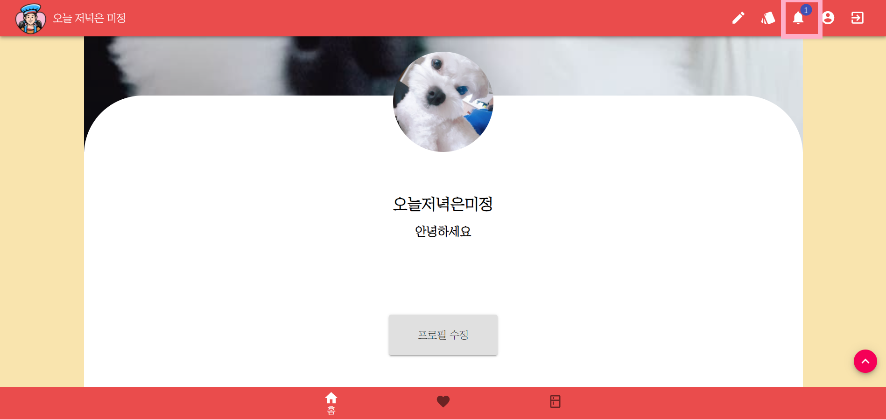

  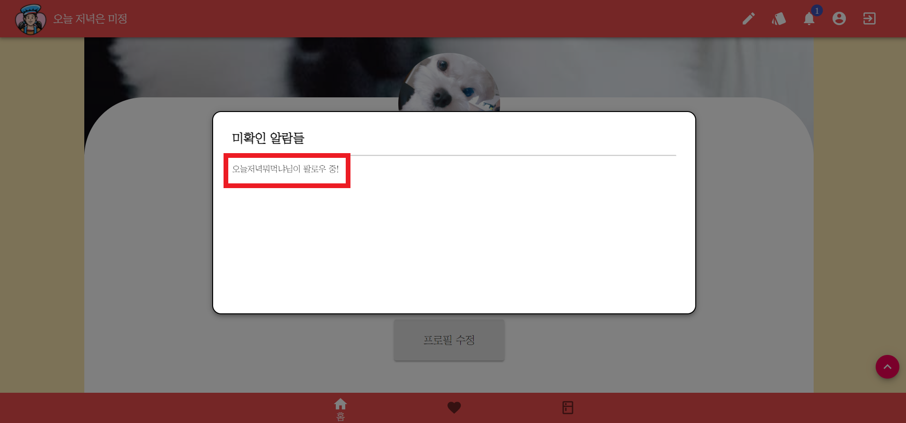

​	

